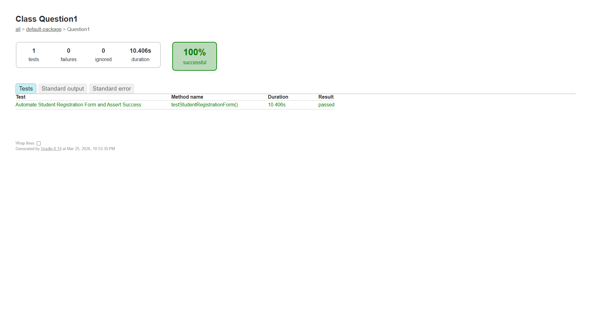
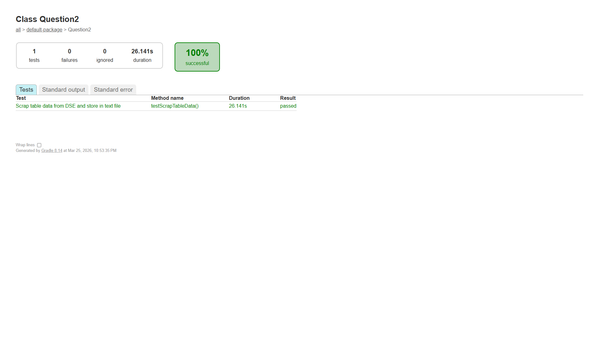

# Assignment 2 - Selenium WebDriver Automation

## Project Overview
This project contains two Selenium WebDriver automation tasks built with Java, JUnit 5, and Gradle.

---

## Task 1: Student Registration Form Automation (Question1.java)
Automates filling out and submitting a student registration form on the TutorialsPoint Selenium practice page.

**Website:** https://www.tutorialspoint.com/selenium/practice/selenium_automation_practice.php

**What it does:**
- Fills in Name, Email, Gender, Mobile, Date of Birth, Subjects, Hobbies
- Uploads a file, enters Address, selects State and City
- Submits the form and asserts all fields were filled correctly

### Recorded Video - Task 1
[Task 1 Video](https://drive.google.com/file/d/1Z_q-8qpK0gpmDZ1UtzO9iU95OnQXZoz0/view?usp=drive_link)

### Test Report Screenshot - Task 1
<!-- Add your report screenshot below -->


---

## Task 2: DSE Stock Price Web Scraping (Question2.java)
Scrapes stock price data from the Dhaka Stock Exchange (DSE) website and stores it in a text file.

**Website:** https://dsebd.org/latest_share_price_scroll_by_value.php

**What it does:**
- Navigates to the DSE latest share price page
- Extracts all table data using JavaScript execution
- Saves the data to `dse_table_data.txt` in tab-separated format
- Asserts that data rows were successfully scraped

### Recorded Video - Task 2
[Task 2 Video](https://drive.google.com/file/d/13RlqShaBXgITQzaOJhzdxBOeRuH7wz8G/view?usp=drive_link)

### Test Report Screenshot - Task 2
<!-- Add your report screenshot below -->


---

## How to Run

### Prerequisites
- Java JDK 11+
- Google Chrome browser installed

### Run all tests
```bash
./gradlew test
```

### Run individual tests
```bash
./gradlew test --tests Question1
./gradlew test --tests Question2
```

### View Test Reports
After running tests, open the HTML report at:
```
build/reports/tests/test/index.html
```

---

## Tech Stack
- **Java** - Programming language
- **Selenium WebDriver 4.27.0** - Browser automation
- **JUnit 5 (Jupiter)** - Testing framework
- **Gradle** - Build tool
